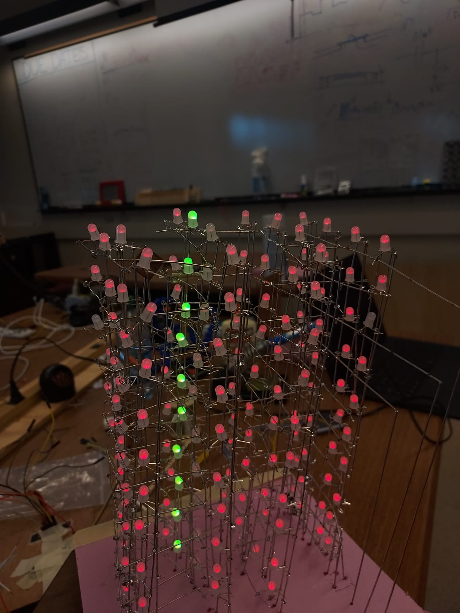

# 3D Tetris

### Demo Gameplay: [https://youtu.be/y2RadXvBAWg](https://youtu.be/y2RadXvBAWg) 

  

# Introduction

3d Tetris is an interactive game that allows the player to play Tetris in three dimensions. The blocks can be translated into 4 directions using joystick and can be rotated across six axes using buttons. The game's state is visually represented on a 4x4x10 LED Cube, while the score is displayed on a 4-digit seven-segment display. To start the game you can press the first red button. 

# Hardware Components

## LED Cube

The 4x4x10 LED cube is created using 160 common anode RGB LEDs. Each vertical section contains 10 LEDs, and they are attached such that their red legs are stuck together, and so are blue and green. Each horizontal section consists of 16 LEDs whose anodes are stuck together. 

## 8 Daisy Chained 8-bit shift registers

To turn all the LEDs individually using Charlieplexing, it would require 58 output pins from the microcontroller. In order to reduce this number, I utilize shift registers. There are two shift registers for the cathode of every color and 2 shift registers for the 10 anodes. Their latch, clear, clock and output enabled are all connected. And their input is the output of the shift register before them. The first shift register gets input from the microcontroller.

## Arduino Mega 2560

I use Arduino Mega 2560 for this project simply because it was available in the lab. This microcontroller is used to send data to the shift registers so that the LED Cube can light up, as well as take in user input and keep processing the software.

## 5641as 4 digit 7-segment display

The 4-digit 7-segment display is used to show the score and is present on the bottom right of the console. It has 12 inputs determining the digit and segment to be displayed, that are directly connected to the Arduino.

## Joystick

A joystick is used to translate the falling block in 4 possible directions which are: towards the player (-y), away from the player (+y), to the right (+x), or to the left (-x). I use threshold with the analogRead values of the Joystick input to make any changes.

## Buttons

The six buttons on the left of the console are for rotation in xy, yz, zx directions respectively. The top row tells clockwise rotations and the bottom row supports counter-clockwise rotation.

# Libraries Used

## SPI

The SPI library is used to transfer data from Arduino to the 8 bit shift registers. 

# Tutorials followed

## 8x8 RGB LED Cube

[https://www.kevindarrah.com/?p=1424](https://www.kevindarrah.com/?p=1424)   
The above website explains the architecture of the LED Cube as well as the logic behind it. Due to some challenges (described later), I could not follow his software implementation and came up with something of my own. He also provides pre-built animations that I used to test my implementation.

## Tetris Logic

[https://www.youtube.com/watch?v=RxWS5h1UfI4\&t=737s](https://www.youtube.com/watch?v=RxWS5h1UfI4&t=737s)   
This tutorial was beneficial in explaining how to deal with object rotations and keep updating the game matrix by a new block. However, it is intended for 2d tetris, so through some modifications (and converting the code from python to c++), I was able to write the software part.

# Designs

I used boxes.py console2 design: [https://www.festi.info/boxes.py/Console2?language=en](https://www.festi.info/boxes.py/Console2?language=en) and modified the panel to hold in buttons, display and joystick.

# Skills

## Persistence of Vision and Charlieplexing

I found the idea of exploiting the persistence of vision and charlieplexing very interesting.   
As explained in the architecture, there are 10 anode and 16 cathodes for every color. To light up the desired LEDs I loop through the anode levels, setting exactly one of them high, and at the same time, set low to the cathodes of the LEDs that need to be turn on. This reduced the output pins from 160 to 26\.

  

## 8-bit shift registers

8-bit shift registers are an extremely versatile tool to virtually increase the number of output pins of a microcontroller. In this project, I use daisy chained 8-bit shift registers to inform what values should be on \-- reducing the requirement of 26 output pin to 3 output pin for clock, data and latch. This however also blocks SPI if needed for some other aspect of project.

# Iterative Process

## Initial Test

I have to iteratively test and build the architecture.

1. Checked whether the LEDs work or not  
2. Create a single column of 10 LEDs and manually check whether the solder is correct  
3. Attached four such columns with their anodes and manually set high and low to test whether appropriate LEDs are turning on  
4. Did the same thing 4 times to finish the architecture.

Then, I created the daisy-chained shift registers. And tested them by sending variable inputs and receiving outputs appropriately.

Once the shift registers and architecture were individually working, I soldered them together and checked them through static displays \[by sending data into shift registers using software\]. Here, I found out that I messed up the wiring of the 5th and 6th cathode entries. So, instead of rewiring, my code switches the binary positions of the 5th and 6th positions before sending data relevant to the cathode to the register.

Finally, once I was satisfied with the static displays, I coded up the logic for 3d Tetris. Here, I realised that since I want things to happen instantaneously, I cannot use delay() so to account for things like debouncing, I changed \`delay\` to finding the difference between current time in milliseconds and the previous time when the action happened. 

## Ideas that didn’t pan out

For me, a bigger constraint in this project was time than the concreteness of the idea. I wanted to add color to the project, and though I was able to get it to work \[refer to the following figure\], but adding up wiring for the green and blue cathodes made the wiring messier and more difficult to debug.  

  

## Hardware that had to be changed

I had to change my daisy-chained registers so that their output is not directly connected to the anodes, but instead, a PNP transistor is driven and raises the output to 5V or 0V.

## Lessons Learned

During this project, I was able to improve my skill in isolating a problem for debugging. If something went wrong in the game, it could be because of issues in different parts of the system, like the architecture, shift registers, or software. At first, I set up my tests to build on each other. For example, one test would check the architecture, and the next one would check both the architecture and the 8-bit shift register. But this caused a bit of trouble because it wasn't clear if any issues were with the registers or the wiring of the architecture. Later, I created unit tests for each part and whenever a problem occurred, I could run them all to find the issue.

I also realized that building hardware takes significantly more time than software development as well as has random bugs \-- such as a loose wire. This led to a significant shift in the time period I anticipated for the project. 

# Artifacts

Iterative building of cube:  
 to  to   

Testing of cube with shift register  
[LED Cube Test Video.mp4](https://drive.google.com/file/d/1Bf3DxeIcwKaEm-6IlDvaN-Q8gCoMg0oe/view?usp=sharing)

# Demo Video

[https://youtu.be/y2RadXvBAWg](https://youtu.be/y2RadXvBAWg) 
